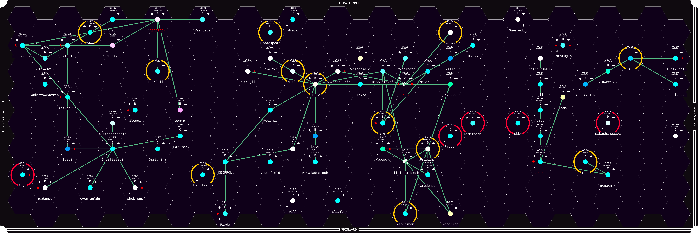

# magellan

A universe map generator for Traveller

------------------------------------------------------------------------------



## What is magellan?

_magellan_ is a tool that can generate random universes for the Sci-Fi TTRPG
system [Traveller](https://en.wikipedia.org/wiki/Traveller_(role-playing_game)),
specifically for the [Mongoose 2nd Edition Rules](https://www.mongoosepublishing.com/collections/start-here).

We can generate subsectors, sectors, universes of arbitrary size, then create a
pretty-looking hexmap of our shiny new sandbox. We can also read in formatted
sector files that contain all the system information we need, and _magellan_
will just make the hexmap for it.

The banner toward the top of this README is an example of what a _magellan_ map
would look like by default. You can always specify options on the command line
to change how it looks, or even go into the source code to alter colors or
whatever else you like.

## What does it do?

_magellan_ will use the sector creation rules contained in the Mongoose
Traveller rulebook to generate a universe of your desired size. It scrapes
existing system names randomly from the [TravellerMap](https://travellermap.com)
website, then uses a Markov chain to generate system names for you. It populates
systems with starports and other points of interest, then plots everything onto
a nice hexmap.

## How can I run it?

In addition to Python, you will need to install the `Pillow` library, which is
what it uses to manipulate and display the images. To install `Pillow`, you can
use the following command:

`$ pip install Pillow`

Most Python installations include the `pip` tool, but if you don't have it you
may need to install it as well.

Once you have all the dependencies, you can run _magellan_ by navigating to the
base directory and invoking the `magellan` script, like so:

```
$ git clone https://github.com/Nynergy/magellan.git
$ cd magellan/
$ ./magellan
```

By default, this will generate a random subsector and create an appropriate
subsector hexmap that is displayed to the user in their image viewer. We can do
much more with _magellan_, however, so let's go over the different options.

## Command Line Options

The usage output is as follows:

```
usage: magellan [-h] [-i INPUT] [-o OUTPUT] [-r {0,90,180,270}] [--no-hexes]
                [--no-trade-lanes] [--no-bases] [--no-zones]
                [--no-system-info] [--no-legends] [--no-color-shift]
                [--subsector-rows SUBSECTOR_ROWS]
                [--subsector-cols SUBSECTOR_COLS]

Render Traveller Maps

optional arguments:
  -h, --help            show this help message and exit
  -i INPUT, --input INPUT
  -o OUTPUT, --output OUTPUT
  -r {0,90,180,270}, --rotate {0,90,180,270}
  --no-hexes
  --no-trade-lanes
  --no-bases
  --no-zones
  --no-system-info
  --no-legends
  --no-color-shift
  --subsector-rows SUBSECTOR_ROWS
  --subsector-cols SUBSECTOR_COLS
```

There are many options for removing certain parts of the map from the final
image, such as`--no-hexes`, `--no-zones`, and `--no-color-shift`. Most of those
are self-explanatory, but `--no-color-shift` will stop the planets with water
from having their blue color slightly hue shifted at random intervals.

The rotate options will take an angle in the set (0, 90, 180, 270) and rotate
the map by that angle before rendering it to an image. This is nifty if you'd
rather have a landscape aspect ratio map instead of the default portrait aspect
ratio.

The subsector column and row options allow you to tell _magellan_ exactly how
many subsectors large the generated universe should be. Be warned that
excessively large maps may take quite some time to generate. By default,
generated maps are a single subsector (1 column, 1 row).

There are also options to output the generated map to a PNG file, and to use a
provided sector file as input for the map renderer. Let's talk about what these
sector files are, because they **must** be properly formatted in order for
_magellan_ to be able to parse them and render their sector maps.

## What are these sector files?

These are files that contain information about the universe being provided. Each
single line details a single system, and is a column-delimited data format. This
means _magellan_ expects to find the hex coordinates for the system starting at
a specific column number in the text file, and the same goes for all other
system information. Here's an example of this format, which I've also included
in the repo as the `endymion.sec` and `hiraeth.subsec` files:

```
Remella         0903 DADA632-5        G Fl Lt Ni Wa 
Deaddon         0907 E98A101-8        G Lo Ni Wa          R
Catus           0909 X754445-3        G Lt Ni 
Keteaux         0910 A8A5769-12      TG Fl Ht 
Glint           1003 A6B2638-12     RTG Fl Ht Ni          A
Zemillion       1006 B220379-14   SNRTG De Ht Lo Ni Po 
Banthra         1008 D8D6744-5        G Fl Lt 
Majesty         1010 C694544-8    S   G Ag Ni 
Othello         1103 D965232-7        G Lo Ni 
Noneko          1105 D665466-7    S   G Ga Ni 
Satchini        1106 D276795-5    S   G Ag Lt 
Shannon         1107 C4105A9-8   P    G Ni 
Thryf           1108 B599675-10      TG Ni 
Aoxi            1109 D8A3688-8    S   G Fl Ni             A
Naroda          1110 B400333-10      TG Lo Ni Va 
Foxcon          1204 D510553-8    S   G Ni 
Talovin         1205 B323630-9    S RTG Na Ni Po 
Aurdan Kane     1206 BAC6551-11      TG Fl Ni             A
Panarth         1302 E375465-4          Lt Ni 
Fog             1303 D776432-5    S   G Lt Ni 
Soryn           1305 C320446-8    S   G De Ni Po 
Conaldi 5       1307 C7A5698-8        G Fl Ni 
Amonule         1309 D89A156-6        G Lo Ni Wa 
Tarumi          1310 E221100-9        G Lo Ni Po 
Exo'Kail        1401 E548655-6        G Ag Ni 
Heluram         1404 B346757-7     N TG Ag 
Clairvoyance    1406 CA9A232-6    S   G Lo Ni Wa          A
Umru            1408 B000553-13   S RTG As Ht Ni Va 
Taida           1504 D8BA797-9        G Fl Wa             A
Suilix          1505 B354675-11    N T  Ag Ni 
High Shore      1508 C5855A9-9    S   G Ag Ni 
Suntose         1509 A4659E9-13      TG Hi Ht 
Quill           1602 E520457-9        G De Ni Po 
Cylon           1603 E446778-8          Ag 
Janel           1604 D500145-8    S   G Lo Ni Va 
Tafaddon        1605 D876499-5        G Lt Ni 
Portus          1607 E430227-6          De Lo Ni Po 
Catronia        1608 D642667-5        G Lt Ni Po 
Obsidian        1609 B000479-12   S  TG As Ht Ni Va 
Galadvin        1610 E340336-8        G De Lo Ni Po 
```

As you can see, the names of each system start the lines, and then you have
their hex coordinates, Universal World Profile (UWP), bases, trade codes, and
zone info. For more information on the specifics of this data format, please see
[this page](https://travellermap.com/doc/fileformats) that goes over various
different formats for storing system info in different Traveller systems. The
one I'm using here is a modified version of the SEC format.

## What now?

Go make some universes, play some Traveller. Have fun :)
